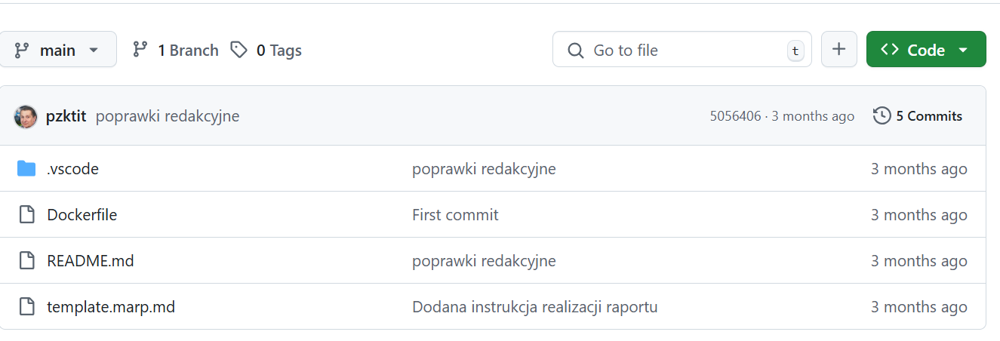
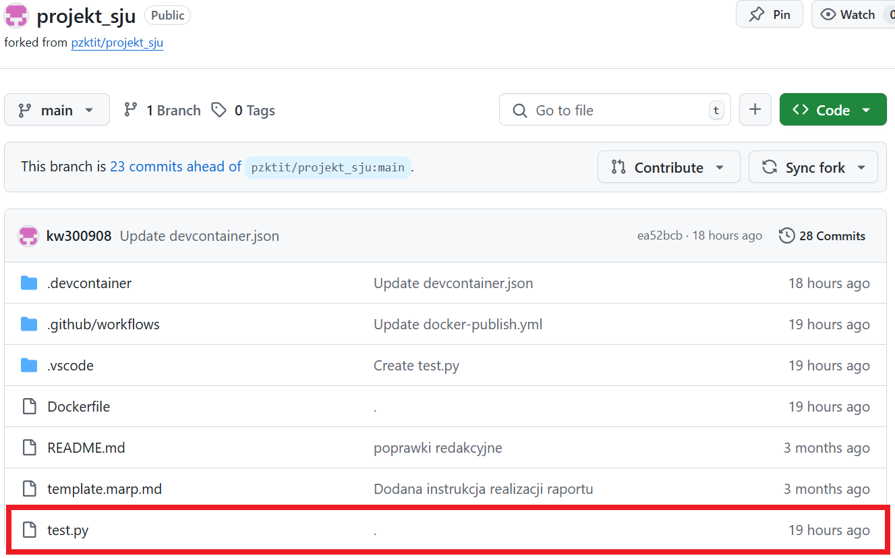
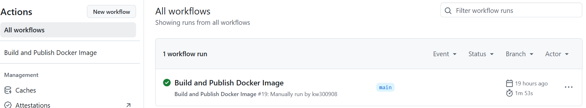
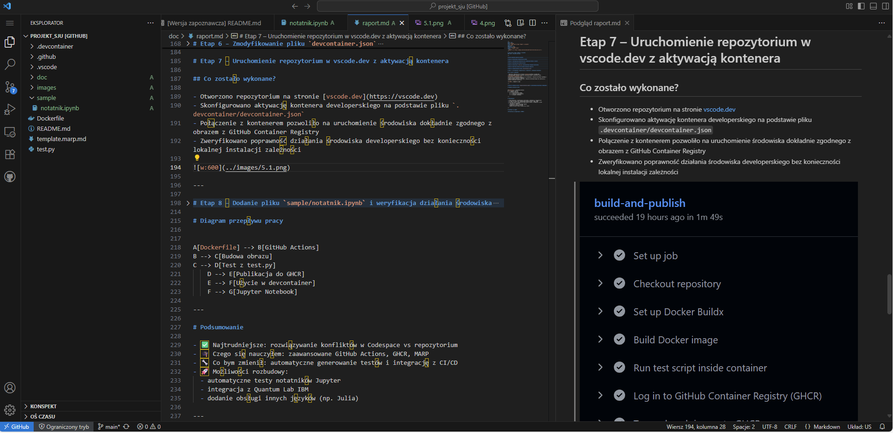
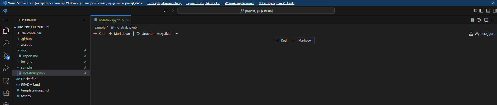
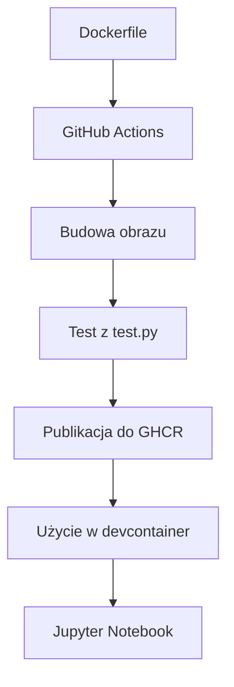

# Sieć jako usługa – Raport z projektu  
### Autor: Krystian Wilczek

---

# Kroki wykonane podczas projektu

1. Stworzenie repozytorium GitHub z wymaganymi plikami
2. Konfiguracja `Dockerfile` do środowiska Python + Qiskit
3. Konfiguracja GitHub Actions do
4. Utworzenie `test.py` sprawdzającego wymagane biblioteki
5. Wysłanie obrazu do GitHub Container Registry
6. Zmodyfikowanie `.devcontainer/devcontainer.json` tak, by wskazywał na obraz z GHCR
7. Uruchomienie repozytorium w `vscode.dev` z aktywacją kontenera
8. Dodanie katalogu `sample/` z notatnikiem Jupyter i weryfikacja działania środowiska


---

# Etap 1 – Stworzenie repozytorium GitHub

Repozytorium `projekt_sju` zostało utworzone jako **fork** szablonu udostępnionego przez prowadzącego na GitHubie.

> W ramach instrukcji należało wykonać forka repozytorium szablonu i pracować bezpośrednio w środowisku Codespaces lub vscode.dev.

W tym etapie utworzono bazowe repozytorium, nie zawierało ono jeszcze kluczowych plików – te zostały dodane w kolejnych etapach projektu.

---



---

# Etap 2 - Konfiguracja Dockerfile do środowiska Python + Qiskit

W pliku `Dockerfile` zdefiniowano środowisko bazujące na obrazie `mcr.microsoft.com/devcontainers/python`.

Dodano instalację wymaganych bibliotek:
- `qiskit` – biblioteka kwantowa
- `matplotlib` – do wizualizacji
- `pillow` / `cryptodome` / `cryptography` – do testów

---

#### Kluczowy kod `Dockerfile`
```dockerfile
FROM python:3.11-slim
RUN pip install qiskit matplotlib pillow pycryptodomex cryptography
COPY test.py .
```

---

# Etap 3 – Konfiguracja GitHub Actions

Workflow w `.github/workflows/docker-publish.yml` skonfigirowano:

- Automatyczne uruchamianie po release i ręcznie (`workflow_dispatch`)
- Budowanie obrazu i testowanie z `test.py`
- Wysyłka do GitHub Container Registry (GHCR)

---

#### Kluczowy kod `docker-publish.yml`
```yaml
on:
  release:
    types: [created]
  workflow_dispatch:

jobs:
  build-and-publish:
    steps:
      - uses: actions/checkout@v4
      - uses: docker/setup-buildx-action@v3
      - run: docker build -t sjuprojekt .
      - run: docker run --rm -v ${{ github.workspace }}:/workspace -w /workspace sjuprojekt python test.py
```

Testowanie:

```yaml
docker run --rm -v ${{ github.workspace }}:/workspace -w /workspace sjuprojekt python test.py
```


---

# Etap 4 – Utworzenie `test.py` sprawdzającego wymagane biblioteki

W tym etapie utworzono plik `test.py` w katalogu głównym repozytorium. Plik ten służył do sprawdzenia, czy w obrazie Dockera zostały zainstalowane wszystkie wymagane biblioteki:

- `qiskit`
- `matplotlib`
- `PIL` (Pillow)
- `Cryptodome` (Pycryptodomex)
- `cryptography`

---

#### Kluczowy kod `test.py`

```python
def test_imports():
    packages = [
        "qiskit",
        "matplotlib",
        "PIL",
        "Cryptodome",
        "cryptography"
    ]
    for pkg in packages:
        try:
            __import__(pkg)
            print(f"✅ {pkg} - OK")
        except ImportError:
            print(f"❌ {pkg} - MISSING")
            exit(1)
```

---



---

# Etap 5 – Wysłanie obrazu do GitHub Container Registry

Po pomyślnym zbudowaniu obrazu i przejściu testów, obraz został wysłany do **GitHub Container Registry (GHCR)**.

W tym celu użyto kroku w pliku `.github/workflows/docker-publish.yml`, wykorzystującego `docker login`, `tag` i `push`.

Dzięki temu środowisko Codespace korzysta z obrazu zbudowanego w GHCR.

---

#### Kluczowa konfiguracja w GitHub Actions

```yaml
- name: Log in to GitHub Container Registry (GHCR)
  uses: docker/login-action@v3
  with:
    registry: ${{ env.REGISTRY }}
    username: ${{ github.actor }}
    password: ${{ secrets.GITHUB_TOKEN }}

- name: Tag and push image to GHCR
  run: |
    IMAGE=${{ env.REGISTRY }}/${{ env.IMAGE_TAG }}
    docker tag ${{ env.IMAGE_NAME }} $IMAGE
    docker push $IMAGE
```
---



------

# Etap 6 – Zmodyfikowanie pliku `devcontainer.json`

Aby wykorzystać obraz z GitHub Container Registry jako środowisko developerskie w VS Code, zmodyfikowano plik `devcontainer.json` wpisując odpowiednia nazwe obrazu, która wskazuje nowo zbudowany obraz w rejestrze GitHub.:

#### Kluczowy kod `devcontainer.json`
```json
{
  "image": "ghcr.io/kw300908/projekt_sju:latest",
  "features": {},
  "settings": {},
  "extensions": []
}
```


---

# Etap 7 – Uruchomienie repozytorium w vscode.dev z aktywacją kontenera

## Co zostało wykonane?

- Otworzono repozytorium na stronie [vscode.dev](https://vscode.dev)
- Skonfigurowano aktywację kontenera developerskiego na podstawie pliku `.devcontainer/devcontainer.json`
- Połączenie z kontenerem pozwoliło na uruchomienie środowiska dokładnie zgodnego z obrazem z GitHub Container Registry
- Zweryfikowano poprawność działania środowiska developerskiego bez konieczności lokalnej instalacji zależności

---



---

# Etap 8 – Dodanie pliku `sample/notatnik.ipynb` i weryfikacja działania środowiska

## Co zostało wykonane?

- Utworzono podkatalog `sample/` w repozytorium
- Dodano przykładowy notatnik Jupyter (`.ipynb`) wykorzystywany na przedmiocie Kwantowe Systemy Teleinformatyki
- Uruchomiono notatnik w środowisku kontenera developerskiego
- Zweryfikowano poprawne działanie kodu i dostępność potrzebnych bibliotek (np. Qiskit)

---



---

# Diagram przepływu pracy



---

# Podsumowanie

- **Najtrudniejsze:**  
  Największym wyzwaniem było radzenie sobie z konfliktami między środowiskiem Codespace a lokalnym repozytorium, zwłaszcza podczas synchronizacji i aktualizacji plików. Konieczne było ręczne rozwiązywanie konfliktów merge, które wynikały z równoczesnych zmian w różnych miejscach projektu oraz poprawne zsynchronizowanie stanu kontenera developerskiego z aktualnym stanem repozytorium.

- **Czego się nauczyłem:**  
  Zaawansowane konfiguracje GitHub Actions, publikację obrazów do GitHub Container Registry (GHCR), a także tworzenie i podgląd prezentacji MARP.

---

- **Co bym zmienił:**  
  Automatyczne generowanie testów i pełną integrację z procesem CI/CD, aby przyspieszyć wykrywanie błędów.

- **Możliwości rozbudowy:**  
  - Automatyczne testy notatników Jupyter  
  - Integracja z Quantum Lab IBM  
  - Dodanie obsługi innych języków (np. Julia)

---


# Dziękuję za uwagę!

**Prezentacja przygotowana w MARP**
